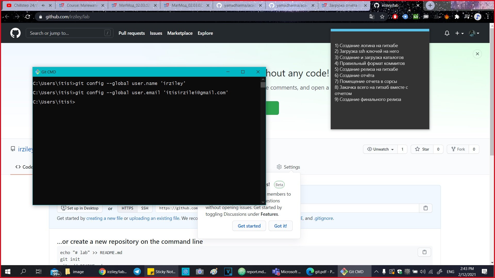
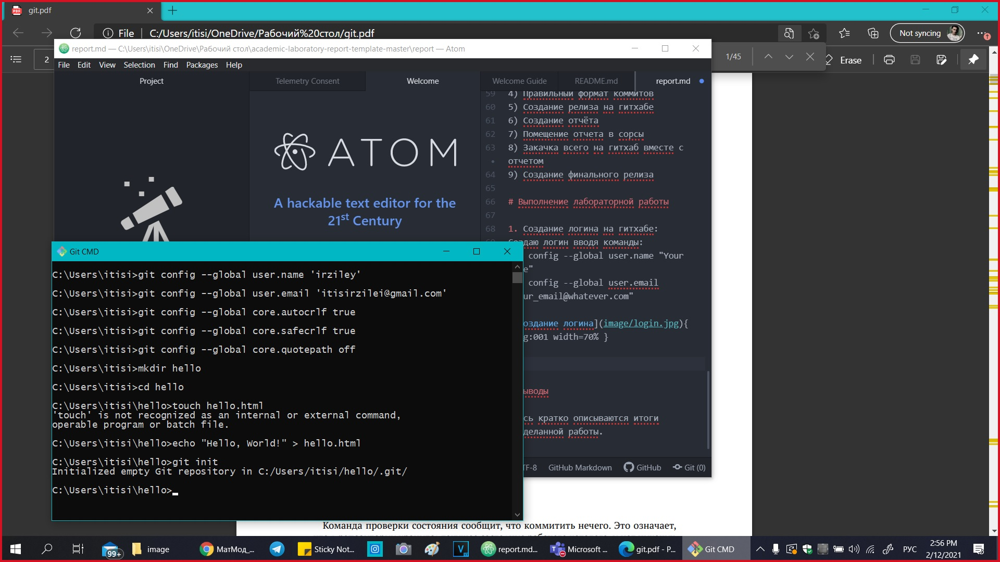
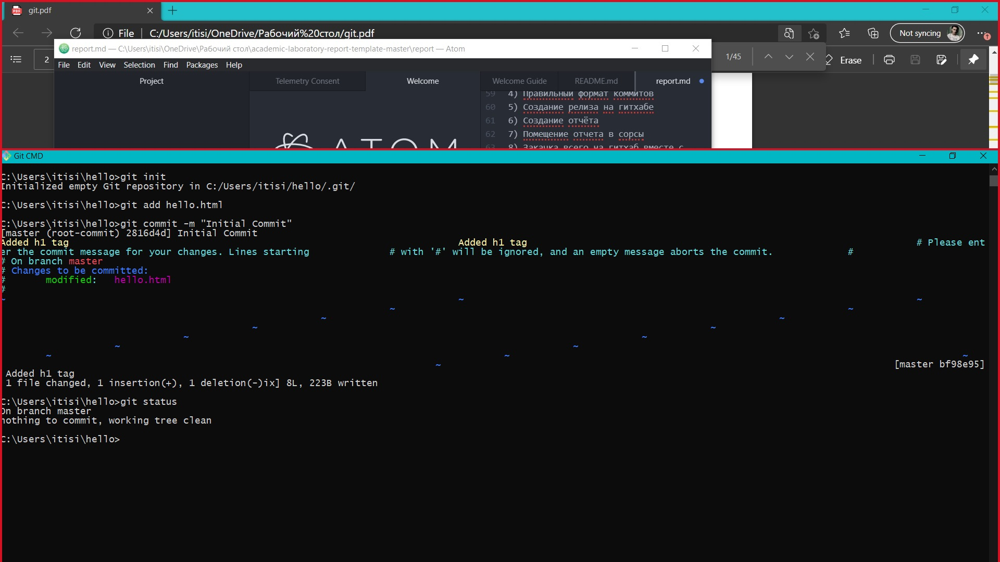
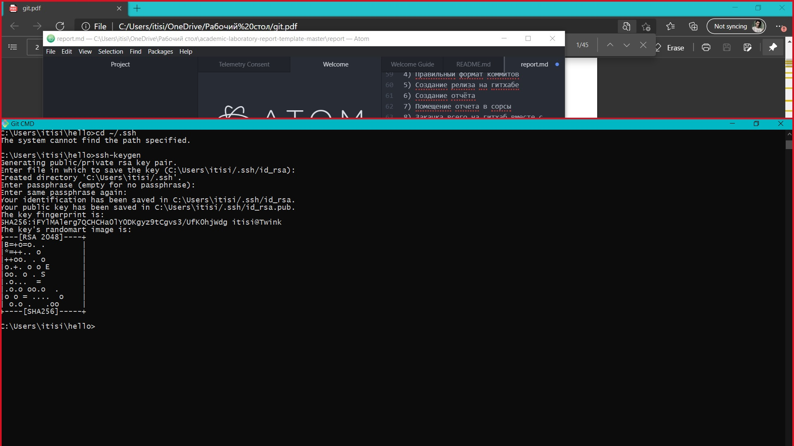
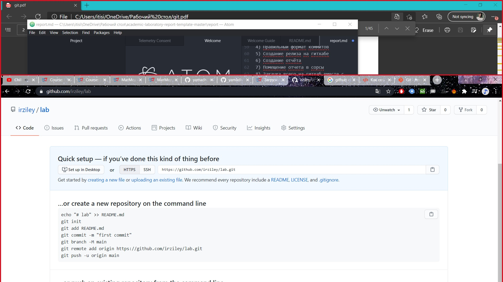
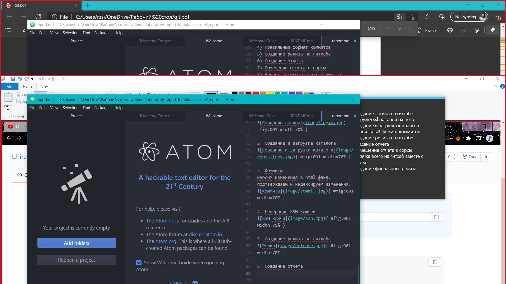

---
# Front matter
lang: ru-RU
title: "Отчёт по лабараторной работе №1"
subtitle: ""
author: "Кученов Ирзилей Сайын Вячеславович, преподаватель: Кулябов Дмитрий Сергеевич"

# Цель работы

Ознакомление с git и github.

# Задание

Выполнить следующие пункты:
1) Создание логина на гитхабе
2) Загрузка ssh ключей на него
3) Создание и загрузка каталогов
4) Правильный формат коммитов
5) Создание релиза на гитхабе
6) Создание отчёта
7) Помещение отчета в сорсы
8) Закачка всего на гитхаб вместе с отчетом
9) Создание финального релиза

# Выполнение лабораторной работы

1. Создание логина на гитхабе:
Создаю логин вводя команды:
git config --global user.name "Your Name"
git config --global user.email "your_email@whatever.com"

{ #fig:001 width=70% }

2. Создание и загрузка каталога:
Создание каталога через веб интерфейс гитхаба.
{ #fig:001 width=70% }

3. Коммиты
Вносим изменения в html файл, подтверждаем и индексируем изменения.
{ #fig:001 width=70% }

4. Генерация SSH ключей
Создание SSH ключей с помощью команды
 ssh-keygen
{ #fig:001 width=70% }

5. Создание релиза на гитхабе
{ #fig:001 width=70% }

6. Cоздание отчёта
Создание отчёта с помощью программы ATOM.
{ #fig:001 width=70% }

Ссылка на гитхаб:
https://github.com/irziley/lab
Ссылка на видео:

# Выводы

Научился работать с git И github, изучил комманды git и работу с репозиториями github.
